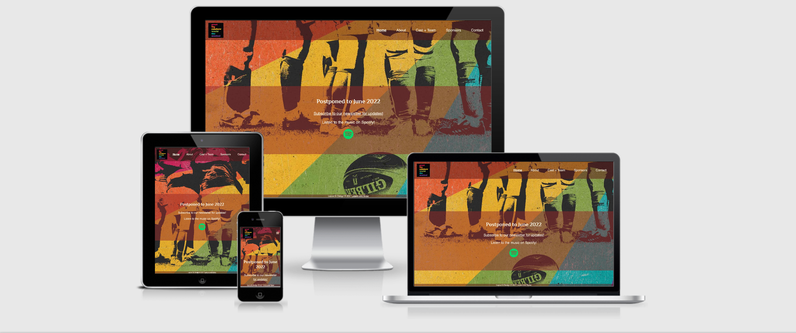

# Great Big Rainbow World

<div align="center">
    
</div>
<br>

[View deployed site here](https://katjacodes.github.io/gbrw/)

## Project Description
The online presence for Great Big Rainbow World was created by Katja Schatte as a digital home for the musical, which is set to premiere in Minneapolis, MN in June 2022.

Great Big Rainbow World was written and produced by Sarah Julius and features a majority LGBTQ+ cast. The musical was originally scheduled to premiere in June 2020. However, due to the COVID19 pandemic, the stage premiere had to be rescheduled several times. This gave Sarah Julius the opportunity to replace the template-based original website with a custom online presence. The goal of the initial version of the new website is to share information about the musical ahead of its premiere and give the public a taste of the musical's original score. Subsequent versions of the website will include a contact form, a link to the musical soundtrack on Spotify, and ticket purchase functionality.

Due to the COVID19 pandemic, the business goals of this website are in flux and can be divided into two categories: goals that are relevant at all times and goals that will become relevant only after the pandemic.

General goals of this website:
* Drive traffic to the musical's Spotify page to garner revenue through Spotify clicks 
* Introduce visitors to the overall theme of the musical with a focus on being light-hearted, women- and LGBTQIA-centered, while still addressing widely relatable issues
* Be appealing to the core audience (based on social media data), Gen Z through Gen X, across the spectrum of gender identity an sexual orientation
* Provide information and a point of contact for the media
* Provide exposure for cast and team members and existing sponsors (coming soon)
* Connect to the musical's social media presence

Goals toward the end of / after the pandemic:
* Ticket sales functionality (coming later)
 

## UX

### Core target audience
#### The core target audience of this musical is:
* Gen Z, Millennials, Gen X (i.e., teenagers through early forties)
* Individuals across the spctrum of gender identity and sexual orientation
* Both people who generally like musicals and people who normally avoid the genre
* Located in the Minneapolis/St. Paul (Minnesota, USA) area

#### Visitors to this website are searching for:
* More information about the musical
* A way to stay updated about the new premiere dates
* Post-pandemic: tickets

#### Client stories
1. As a new visitor to the website, I want to have easy access to the music, so I can get a taste of the musical.
2. As a new visitor to the website, I want find reader-friendly, well-organized information about the musical's content, background, and those involved in it.
3. As a new visitor to the website, I want to find out how I can connect with the musical, especially on social media platforms I already use.
4. As someone already familiar with the musical, I want to have a way to stay updated about recent developments related to the musical, including its new premier date.
5. As someone already familiar with the musical, I want to know which businesses in my community financially support artistic production. (In progress)
6. As a journalist focusing on local news and/or LGBTQIA issues, I want to be have access to background information about the musical and ways of contacting those involved.

### Wireframe mockups: 
- [Home](assets/images/wireframes/gbrwHOME.png)
- [About](assets/images/wireframes/gbrwABOUT.png)
- [Cast + Team and individual profile pages](assets/images/wireframes/gbrwCASTANDTEAM.png)
- [Sponsors](assets/images/wireframes/gbrwSPONSORS.png)
- [Contact](assets/images/wireframes/gbrwCONTACT.png)

## Features

#### Across Pages
Each page features a responsive **navigation bar** with conventional placing of **logo** (top left).
Each page has a **footer** with **copyright information**. 

Every page features a background created by the same artist who created to artwork for posters, flyers, and social media presence to make sure the website is on brand. 

#### Home
The home page features a background imagethat draws the vistor's attention to the central topic of the musical: rugby. The background image is cropped to make the content recognizable and aesthetically appealing across devices and screen orientations. To that end, there are three different versions of the image: a version for screens below 768px, a version for screens above 768px, and a version for phone and tablet screens in portrait orientation.

The **Jumbotron** on the homepage features the two major ways visitors can interact with the musical at this point: A direct **link to the contact form** and a **Spotify button** leading the visitor to the musical's Spotify. At the moment, the client is particularly interested in visitors visiting the musical's Spotify page to generate revenue and for visitors to have an easy way to stay up to date about new developments, including a new premier dates. Due to the evolving business needs of the client, the homepage is designed in a way that its content can easily be updated and adapted. 

#### About
The About page features a brief synopsis and background information about the musical. The copy was provided by Sarah Julius, writer, composer and producer of _Great Big Rainbow World_. Visitors who prefer traditional writing to social media content or who are looking for a quick way to get an overview of the musical (e.g., for potential media requests), this page provides all the necessary information.

#### Cast + Team and Individual Profile Pages
The cast and teams page consists of **two responsive grids**: one featuring the **pictures and names** of the cast and one featuring the pictures and names of the creative team. The standard setting of the grid is two images per row. Above that, the grid features three images per row on screens 768px and above, four images per row on screens 992px and above, and six images per row on screens 1400px and above. In addition, the image size increases for screens 768px and above. The purpose of this structure is to provide a clean and organized overview of everyone involved, despite the relatively large number or cast and team members. 

In addition, each image and name is clickable and **links** an **individual profile** featuring a profile image (larger for screens 992px and above, the cast or team member's name, pronouns, and role and a brief quote and personal information. The breakpoint for the styling of the quotes is 576px to strike a balance between readability and aesthetics. 

All content for the grid and the individual pages was provided by the artists themselves.

#### Sponsors
Due to the tight deadline of the course, it was agreed upon with the client to post a **"Coming Soon"** disclaimer on the sponsors page for now. After the next update, the sponsors pags will be styled simiarly to the cast and team page, featuring the logos and names of all current sponsors.

#### Contact
The contact page consists of three sections. The first section features links to the musicals **Facebook** and **Instagram** presence. The second section consists of sign-up form for the **newsletter**, which requests the visitor's email address followed by a *Submit  button**.  Finally, the third section consists of message form requesting the visitor's name and email address followed by a box to leave a message and another **Submit button**.

 
### Existing Features
- Header Logo - Exists on [every page](index.html) and allows all users to easily recognise the business brand. Clicking the logo returns users to the home page as they would expect.
- Header Navigation Bar - Exists on [every page](index.html) and allows all users to easily navigate all the website's pages and find what they are looking for quickly.
- Footer Copyright Info - Exists on [every page](index.html) and protects business copyright.
- [About Page](about.html) - Allows potential clients to connect with the artist without overloading them with information.
- [Cast + Team Page](castandteam.html)
- Social Media links - Linking to the musical's presence on Spotify, Facebook, and Instagram

### Features to Implement in future
- _Functioning_ [Contact Form](contact.html) - Allows potential clients to ask questions, and/or make the first step in their ordering process. - Backend functionality needed. Will be provided by the client's web host once the page is deployed there.
- Add CAPTCHA to contact form - Helps protect the contact form from malicious use, i.e., spam - JavaScript needed
- [Sponsors page](sponsors.html) - Features all businesses and organizations currently supporting the musical.
- Ticket purchase functionality - Backend skills needed
- Improve loading speed on mobile devices - Optimizes experience for visitors using their mobile device to access the page. - Further tinkering with image files, sripts, and stylesheents necessary.

## Technologies Used
- This project uses HTML and CSS programming languages.
- [Gitpod](https://gitpod.io) 
    - This project uses **Gitpod** for their IDE.
- [BootstrapCDN](https://www.bootstrapcdn.com/)
    - This project uses **Bootstrap4** to simplify the structure of the website and make the website responsive
    - This project also uses BootstrapCDN to provide icons from [FontAwesome](https://www.bootstrapcdn.com/fontawesome/)
- [Google Fonts](https://fonts.google.com/)
    - This project uses **Google fonts** to style the website fonts.
- [jQuery](https://jquery.com/)
    - This project uses **jQuery** to reference Javascript needed for the responsive navbar.
- [Popper.js](https://popper.js.org/)
    - This project uses **Popper,js** to reference Javascript needed for the responsive navbar.
- [ColorSpace](https://mycolor.space)
    - This project uses **ColorSpace** to determine font colors that go well together.
- [WAVE](https://wave.webaim.org)
    - This project uses the Web Accessibilty Evaluation Tool to make sure the website if accessible to visitors of differing abilities. 
- [WebAIM](https://webaim.org/resources/contrastchecker/)
    - This project uses the WebAIM contrast checker to make sure the website is accessible to readers with impaired vision.
- [Google PageSpeed Insights](https://developers.google.com/speed/pagespeed/insights/)
    - This project uses Google PageSpeed Insights to optimize loading time.

## Testing 
Testing information can be found in separate [TESTING.md file](TESTING.md)

## Deployment
This project was developed using the [Gitpod](https://gitpod.io), committed to git, and pushed to GitHub using the Gitpod terminal. 

To deploy this page to GitHub Pages from its [GitHub repository](https://github.com/katjacodes/gbrw), the following process was completed: 
1. Log into GitHub. 
2. Klick on the account avatar in the top right corner and select "Your repositories" from the dropdown menu.
3. From the list of repositories, select **gbrw**.
4. From the menu bar at the top of the page, select **Settings**.
5. In the menu bar on the left side of the screen, select the second menu item from the bottom, "Pages."
6. In the **Source** section, select **Master Branch** from the dropdown menu, then click on **Save**.
7. As a result, the page is refreshed and the website deployed. The **website URL** appears in a blue box above the **Source Section**.

At the moment of submitting this Milestone project the Development Branch and Master Branch are identical. 

### How to run this project locally
To clone this project into Gitpod you will need a Github account. [Create a Github account here](https://github.com/)

Then follow these steps:
1. Log into [Gitpod](https://gitpod.com) with your gitpod account.
2. Navigate to the [Project GitHub repository](https://github.com/katjacodes/gbrw)
3. Click the green "Gitpod" button in the top right corner of the respository
4. This will trigger a new gitpod workspace to be created based on the code in GitHub. There, you will be able to work locally.

To work on the project code within a local IDE such as VSCode, Sublime Text, etc.:
1. Navigate to the [Project GitHub repository](https://github.com/katjacodes/gbrw)
2. Click the "Code" download button next to the green "Gitpod" button.
3. In the Clone section, select HTTPs and copy the clone URL for the repository. 
4. Open your local terminal.
5. Change the current working directory to the location where you want the cloned directory to be located.
6. Type ```git clone```, and then paste the URL you copied in Step 4.
7. Press Enter for your local clon to be created.

## Credits

### Content
- The text for the About page was written by Sarah Julius. Each artist and member of the creative time provided their own bio and headshot.

### Media
- The background images and logo were created by [#].

### Code
- HTML code for burger menu was original taken from [W3 Schools](https://www.w3schools.com/bootstrap4/tryit.asp?filename=trybs_navbar_collapse) and then edited.
- CSS code to align and size logo and navbar was originally taken from a post on [Stackoverflow](https://stackoverflow.com/questions/53171559/navbar-smaller-than-navbar-brand) and then edited.
- CSS  code to center text in the footer was taken from [W3 Schools](https://www.w3schools.com/css/css_align.asp).
- CSS code to style quotes on the individual profile pages was original taken from Jonathan Clift's profile on [Codepen](https://codepen.io/cliftwalker/pen/XJaEXY) and then edited.
- The design of the Cast + Team page was inspired by the [Vera Institute](https://www.vera.org/about/peoplehttps://www.vera.org/about/people). However, no code was taken from the site.

### Acknowledgements
- I got the opportunity to build a website for a real-world project from Sarah Julius.
- Code Institute tutors were helpful and guided me in the right direction on two separate occasions when I got stuck did not know how to fix my CSS>